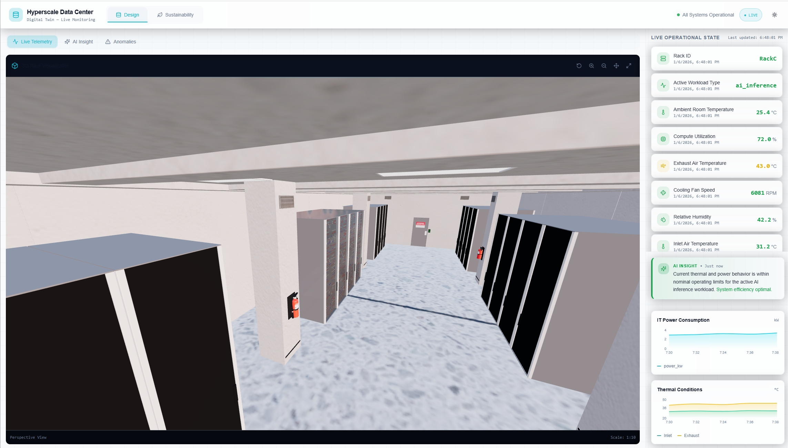
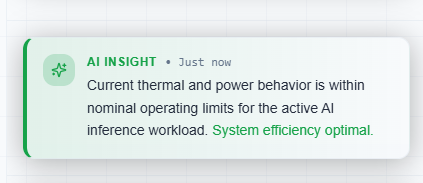
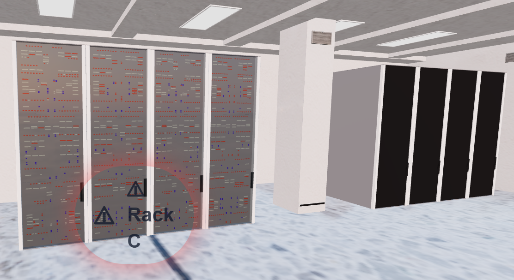
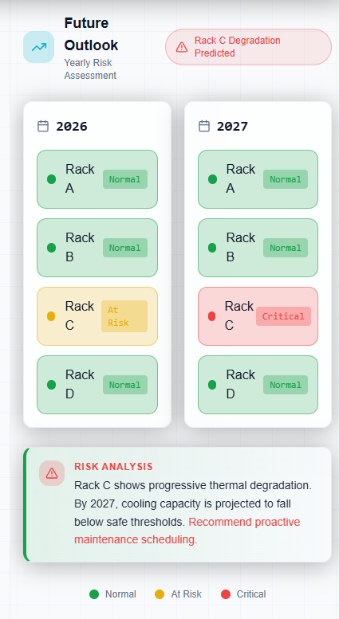
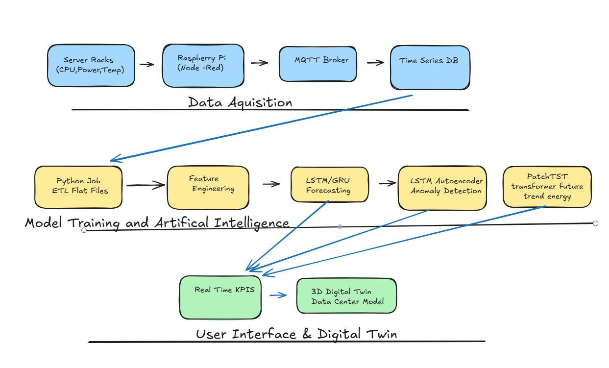

# Hyperscale Data Center — AI-Enabled Digital Twin

An AI-powered digital twin for hyperscale data centers: a real-time 3D visualization of server racks, workloads, and thermal dynamics, backed by deep learning models for forecasting, anomaly detection, and sustainability planning.



## What it does

- Renders a **live 3D digital twin** of the data hall, with each rack spatially mapped to its physical counterpart and streaming real-time telemetry
- Continuously evaluates telemetry with **AI health insights**, forecasting near-future trends and classifying each rack as Nominal, Watch, or Critical
- Runs **unsupervised anomaly detection** and highlights affected racks directly in the 3D view
- Performs **sustainability what-if analysis** — cooling-policy sensitivity and multi-year risk projection per rack — to recommend proactive intervention

## Features

### AI-Assisted Health Insights
Live telemetry is continuously evaluated against expected behavior, with short-term forecasting flagging emerging issues before they become critical.



### Anomaly Detection
Abnormal behavior is detected automatically and highlighted on the affected rack directly in the 3D view, with full anomaly history (timestamp, metric deviation, severity) for faster diagnosis.



### Sustainability & Risk Forecasting
Multi-year risk projections combine forecasted load with cooling-sensitivity analysis (±2°C CRAC scenarios) to flag at-risk racks and recommend proactive maintenance.



## Architecture

```
                 ┌───────────────┐
                 │  Data Acquisition   │
                 │  Server racks (CPU, Power, Temp)
                 │  → Raspberry Pi (Node-RED)
                 │  → MQTT Broker
                 │  → Time-Series DB
                 └────────┬──────┘
                          ▼
                 ┌──────────────────────────┐
                 │  Model Training & AI            │
                 │  Python ETL → Feature Engineering │
                 │  → LSTM/GRU Forecasting              │
                 │  → LSTM Autoencoder (Anomaly)         │
                 │  → PatchTST (energy trend forecasting)  │
                 └────────┬──────────────────┘
                          ▼
                 ┌──────────────────────┐
                 │  User Interface & Digital Twin │
                 │  Real-time KPIs → 3D Data Center Model │
                 └──────────────────────┘
```



**Data Acquisition Layer** — simulated server racks (A–D) with CPU, power, temperature (ambient/inlet/exhaust), fan speed, and humidity sensors; Raspberry Pi edge devices and Node-RED flows aggregate, normalize, and publish telemetry to the IoT broker.

**IoT & Platform Layer** — MQTT broker + ThingsBoard for device management, rule-based alerting, and real-time WebSocket streaming; TimescaleDB (PostgreSQL) persists all telemetry as time-series data.

**Data Engineering & Feature Processing Layer** — Python ETL jobs extract historical telemetry from TimescaleDB, converting it into flat per-rack datasets with scaling, derived thermal features, and sliding-window sequences for model training.

**AI / Inference Layer** — a FastAPI microservice (`ai-service/`) serves four model-backed capabilities:

| Capability | Model | Purpose |
|---|---|---|
| Short-term health insight | LSTM | Forecasts near-future operating trends; classifies rack health |
| Anomaly detection | LSTM-Autoencoder | Unsupervised detection of abnormal rack behavior |
| Energy forecasting | PatchTST (transformer) | Time-series forecasting for sustainability what-if analysis |
| Sustainability risk scoring | Rule engine + PatchTST | Multi-year degradation-risk scoring per rack |

**Visualization Layer** — a real-time 3D digital twin (React Three Fiber) with live telemetry overlays, AI health classification, and anomaly highlighting.

## Repository Structure

```
hyperscale_data_center/
├── ai-service/                 # FastAPI inference microservice
│   ├── app.py                   # API routes: insight, anomaly, energy forecast, sustainability risk
│   ├── models/                  # Trained model artifacts (LSTM, LSTM-AE, PatchTST, scalers)
│   ├── services/                # forecast.py, anomaly.py, energy_forecast.py, patchtst_loader.py, risk.py
│   └── schemas/                 # Pydantic request/response schemas
├── ai_models/                   # Rack Telemetry ML Pipeline
│   ├── notebooks/, scripts/     # TimescaleDB → flat datasets → LSTM/GRU + Autoencoder training
│   └── README.md
├── IoTFramework/
│   ├── Bulk_Simulators/          # C#/.NET bulk IoT device simulators (MQTT + ThingsBoard provisioning)
│   ├── Sensors/                  # Node-RED flows per rack (A–D) + anomaly detection flow
│   └── docker/                   # ThingsBoard + TimescaleDB + RabbitMQ docker-compose stack
├── ui/                           # Primary digital twin viewer — React + TypeScript + Vite
│                                 # (shadcn/ui, Radix, Tailwind, @react-three/fiber, @react-three/drei, TanStack Query)
├── hyperscale-viewer/            # Earlier prototype viewer (JS, legacy 3D model loader + mock server)
└── docs/images/                  # README screenshots and diagrams
```

## Tech Stack

| Layer | Tools |
|---|---|
| Edge / simulation | C# (.NET), Node-RED, Raspberry Pi |
| IoT platform | MQTT, ThingsBoard |
| Data storage | TimescaleDB (PostgreSQL) |
| ML / AI | Python, Pandas, NumPy, TensorFlow/Keras, PyTorch, LSTM, LSTM-Autoencoder, PatchTST |
| Backend API | FastAPI |
| Frontend | React, TypeScript, Vite, Three.js (@react-three/fiber, @react-three/drei), shadcn/ui, Tailwind CSS |
| Infra | Docker Compose |

## Setup

**AI inference service:**
```bash
cd ai-service
python -m venv svc
svc\Scripts\activate
pip install -r requirements.txt
uvicorn app:app --host 0.0.0.0 --port 8000 --reload
```

**ML training pipeline:**
```bash
cd ai_models
python -m venv env
env\Scripts\activate
pip install -r requirements.txt
jupyter lab
```

**Digital twin viewer:**
```bash
cd ui
npm install
npm run dev
```

**IoT simulation stack** (ThingsBoard + TimescaleDB + RabbitMQ):
```bash
cd IoTFramework/docker
docker-compose -f docker-compose.tb.yml up -d
```
